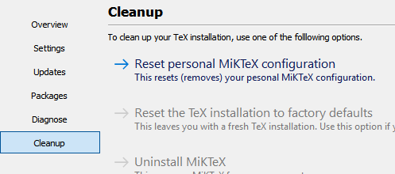

# MiKTeX Change Log

## 2.9.7300 - not yet released

### Grouped-delimited \input argument

MiKTeX adopted the forthcoming TL 2020 \input enhancement which allows
you to specify file names with spaces:

```
\input{my stuff}
\input{"my stuff"}
```

To quote Karl Berry:

> For TL 2020, I think we're going to be able to extend
> \input so that it can take a grouped argument (\input{...}), and thus
> allow any character in the name -- except that " characters will still
> be eliminated, at LaTeX's request.  This won't affect the standard
> space/token-delimited use of \input in any way.

### CentOS 8

MiKTeX is now available for CentOS 8. Quick installation instructions:

```
sudo rpm --import "https://keyserver.ubuntu.com/pks/lookup?op=get&search=0xD6BC243565B2087BC3F897C9277A7293F59E4889"
sudo curl -L -o /etc/yum.repos.d/miktex.repo https://miktex.org/download/centos/8/miktex.repo
sudo dnf update
sudo dnf install miktex
```

Please read this [HOWTO](https://miktex.org/howto/install-miktex-unx),
if this is the first time you install MiKTeX for Linux.

### LCDF Typetools

The MiKTeX distribution now includes [LCDF Typetools](https://ctan.org/pkg/lcdf-typetools),
a bundle of outline font manipulation tools.

### Upgraded programs

* asymptote 2.62
* autosp 2019-12-22
* dvipdfmx 20200116
* dvipng 1.17
* dvips 2020.1
* dvisvgm 2.8.2
* pdftex 1.40.21

### Upgraded libraries

* libpng 1.6.37

### Fixed issues

* [420](https://github.com/MiKTeX/miktex/issues/420): miktexsetup fails -- how to advance?
* [422](https://github.com/MiKTeX/miktex/issues/422): Increase font_mem_size upper limit
* [428](https://github.com/MiKTeX/miktex/issues/428): GSF2PK failed on postscript font
* [435](https://github.com/MiKTeX/miktex/issues/435): language patterns in the format can not be changed manually
* [438](https://github.com/MiKTeX/miktex/issues/438): Create "fc-cache.exe" as alias
* [441](https://github.com/MiKTeX/miktex/issues/441): Cannot build new format
* [448](https://github.com/MiKTeX/miktex/issues/448): miktex-makepk fails if the transcript file does not exist
* [451](https://github.com/MiKTeX/miktex/issues/451): Clicking Close button vs pressing Esc key upon finished package installation
* [459](https://github.com/MiKTeX/miktex/issues/459): dvipng 1.16 with pk fonts error on Win32

## 2.9.7250 - 2019-11-12

### New programs

* LuaHBTeX 1.11.2

### Upgraded programs

* LuaTeX 1.11.2

### Fixed issues

* [25](https://github.com/MiKTeX/miktex/issues/25): tex4ht support
* [328](https://github.com/MiKTeX/miktex/issues/328): initexmf: access denied error
* [411](https://github.com/MiKTeX/miktex/issues/411): texify does not run bibtex

## 2.9.7230 - 2019-10-28

Fixed macOS build issues.

## 2.9.7200 - 2019-10-22

### Breaking changes

#### Windows: text files with UNIX line endings

All TeX engines now write text output files with UNIX line endings.

#### EPS-to-PDF converter embeds all fonts

The `miktex-epstopdf` utility now creates a PDF with embedded fonts.

### New programs

* synctex 1.5

### Downgraded programs

* luatex 1.10.0

### Fixed issues

* [353](https://github.com/MiKTeX/miktex/issues/353): luatex 1.10.1 has a bug affecting font usage
* [363](https://github.com/MiKTeX/miktex/issues/363): SyncTeX binaries?
* [369](https://github.com/MiKTeX/miktex/issues/369): luatex doesn't handle commands in the name of the main file correctly
* [370](https://github.com/MiKTeX/miktex/issues/370): line endings
* [373](https://github.com/MiKTeX/miktex/issues/373): tftopl failed with large .tfm file
* [376](https://github.com/MiKTeX/miktex/issues/376): Miktex Update removes essential packages
* [377](https://github.com/MiKTeX/miktex/issues/377): pdfcrop: The script engine could not be found.
* [391](https://github.com/MiKTeX/miktex/issues/391): miktex-console_admin building format fails

## 2.9.7140 - 2019-07-31

### New programs

* [harftex](https://github.com/khaledhosny/harftex): new TeX enginge with embedded HarfBuzz and Lua

### Upgraded programs

* dvipdfmx 20190522
* luatex 1.10.1

### Upgraded libraries

* harfbuzz 2.5.3

## 2.9.7050 - 2019-05-30

### Breaking changes

#### `--c-style-errors` does not imply `\scrollmode` anymore

You can use the `--interaction=scrollmode` option, if you depend on the old behaviour:

```
pdflatex --c-style-errors --interaction=scrollmode document.tex
```

### Upgraded programs

* dvipdfmx 20190305

### Upgraded libraries

* uriparser 0.9.2

### Fixed issues

* [181](https://github.com/MiKTeX/miktex/issues/181): Make file-line-error more talkative
* [293](https://github.com/MiKTeX/miktex/issues/293): Bundles old vulnerable copy of uriparser 0.8.6, please update
* [294](https://github.com/MiKTeX/miktex/issues/294): kpsewhich not in PATH in MacOS
* [312](https://github.com/MiKTeX/miktex/issues/312): MiKTeX Setup Wizard ignores --user-install in Windows 10

## 2.9.7000 - 2019-04-10

### Upgraded programs

* dvipdfmx 20190225
* dvipng 1.16
* dvips 5.999
* dvisvgm 2.6.3
* Gregorio 5.2.0
* luatex 1.10.0
* tex4ht 2018-07-03-10:36
* TeXworks 0.6.3

### Fixed issues

* [195](https://github.com/MiKTeX/miktex/issues/195): Add option to change directory for binaries (Linux)
* [262](https://github.com/MiKTeX/miktex/issues/262): keeping user/admin updates in sync
* [263](https://github.com/MiKTeX/miktex/issues/263): MPM crashes with --require=@
* [264](https://github.com/MiKTeX/miktex/issues/264): MiKTeX failed to test file existence for /dev/null, on macOS and Linux
* [272](https://github.com/MiKTeX/miktex/issues/272): TEXMFHOME is empty on Windows
* [279](https://github.com/MiKTeX/miktex/issues/279): Latest GregorioTeX update did not include updated binary

## 2.9.6980 - 2019-02-11

### Fixed issues

* [254](https://github.com/MiKTeX/miktex/issues/254): biber: missing on Ubuntu and Mac

## 2.9.6960 - 2019-02-04

### Upgraded programs

* dvipdfmx 20190127
* dvisvgm 2.6.2
* luatex 1.09.2

### Fixed issues

* [249](https://github.com/MiKTeX/miktex/issues/249): TeXworks blocks FNDB

## 2.9.6930 - 2019-01-06

### Resetting personal MiKTeX configuration

In order to avoid leftovers, MiKTeX Console learned to reset the
personal MiKTeX configuration if MiKTeX was installed system-wide:



This allows users to remove their MiKTeX related installation files
before a system administrator completely uninstalls MiKTeX.

### Admin mode: blinding out of personal MiKTeX configuration

Prior to MiKTeX 2.9.6930, personal TEXMF root directories were visible
(e.g., in MiKTeX Console) when running in administrator mode. This
behaviour has been changed: in MiKTeX 2.9.6930 and higher, personal
TEXMF root directories are blinded out when running in administrator
mode.

### Update improvements

The `Check for updates` operation is much faster now.

### Upgraded programs

* dvipdfmx 20181221
* XeTeX 0.999991

### Fixed issues

* [43](https://github.com/MiKTeX/miktex/issues/43): MPM (admin) cannot be run if TeXworks is running
* [220](https://github.com/MiKTeX/miktex/issues/220): MikTex TexWorks on Mac not displaying any text.
* [222](https://github.com/MiKTeX/miktex/issues/222): Running MiKTeX commands in parallel fails
* [226](https://github.com/MiKTeX/miktex/issues/226): xetex does not look for local user's font folder
* [235](https://github.com/MiKTeX/miktex/issues/235): Multithreading poppler utilities on windows yields errors

## 2.9.6880 (intermediate) - 2018-11-12

### Upgraded programs

* dvipdfmx 20181012
* Dvisvgm 2.6
* LuaTeX 1.09.0

### Upgraded libraries

* cairo 1.16.0
* expat 2.2.6
* fontconfig 2.13.1
* FreeType 2.9.1
* gmp 6.1.2
* graphite2 1.3.12
* HarfBuzz 2.0.2
* hunspell 1.6.2
* jpeg 9c
* libcurl 7.61.1
* liblzma 5.2.4
* libpng 1.6.35
* LibreSSL 2.8.2
* m-tx 0.63a
* mpfr 4.0.1
* mspack 0.8alpha
* teckit 2.5.8
* uriparser 0.8.6
* zzip 0.13.68

## 2.9.6840 - 2018-09-30

### Fixed security issues

#### CVE-2018-17407

This applies to MiKTeX (TeX Live is an upstream source):

> An issue was discovered in t1_check_unusual_charstring functions in writet1.c files in TeX Live before 2018-09-21.
> A buffer overflow in the handling of Type 1 fonts allows arbitrary code execution when a malicious font is loaded by one of
> the vulnerable tools: pdflatex, pdftex, dvips, or luatex.

More info: [https://nvd.nist.gov/vuln/detail/CVE-2018-17407](https://nvd.nist.gov/vuln/detail/CVE-2018-17407)

### Fixed issues

* [199](https://github.com/MiKTeX/miktex/issues/199): miktex searches the whole file system if grffile is used

## 2.9.6800 - 2018-08-27

### Fedora 28 & openSUSE Leap 15

MiKTeX is now available for Fedora 28 and openSUSE Leap 15.

### Fixed issues

* [36](https://github.com/MiKTeX/miktex/issues/36): enhance support to install packages from a list file
* [50](https://github.com/MiKTeX/miktex/issues/50): pdftex (started via the compiler driver) can't find input files if the main file is on a network drive
* [66](https://github.com/MiKTeX/miktex/issues/66): [MikTeX Portable] Can't add local texmf directory
* [149](https://github.com/MiKTeX/miktex/issues/149): Texify / macOS: "The TeX engine could not be found."
* [156](https://github.com/MiKTeX/miktex/issues/156): latexmk does not work on a fresh mac install
* [161](https://github.com/MiKTeX/miktex/issues/161): xelatex: -disable-installer is not propagated to miktex-makemf
* [166](https://github.com/MiKTeX/miktex/issues/166): Alternative for sudo
* [168](https://github.com/MiKTeX/miktex/issues/168): Installing MiKTex via Command Line
* [174](https://github.com/MiKTeX/miktex/issues/174): initexmf --force --mklinks --admin fails if TeXworks is open

## 2.9.6730 - 2018-06-29

### OS X El Capitan & macOS Sierra

MiKTeX is now available for these older Macintosh platforms:

* OS X El Capitan
* macOS Sierra

### Upgraded libraries

* HarfBuzz 1.8.0

### Fixed issues

* [42](https://github.com/MiKTeX/miktex/issues/42): download of cm-super is speed-limited
* [116](https://github.com/MiKTeX/miktex/issues/116): Cannot run on El Capitan
* [138](https://github.com/MiKTeX/miktex/issues/138): U+0361 COMBINING DOUBLE INVERTED BREVE is misaligned when using Linguistics Pro font
* [143](https://github.com/MiKTeX/miktex/issues/143): MiKTeX portable creates start menu entries
* [148](https://github.com/MiKTeX/miktex/issues/148): MiKTeX Console: uninstall MiKTeX

## 2.9.6700 - 2018-05-21

### Ubuntu 18.04 & Debian 9

MiKTeX is now available for Ubuntu 18.04 and Debian 9.  See [this
howto](https://miktex.org/howto/install-miktex-unx) for more info.

### Upgraded programs

* dvipdfmx 20180506
* Dvisvgm 2.4

### Fixed issues

* [94](https://github.com/MiKTeX/miktex/issues/94): Silent uninstall in Windows
* [120](https://github.com/MiKTeX/miktex/issues/120): Installation error in Ubuntu 18.04
* [122](https://github.com/MiKTeX/miktex/issues/122): Get back "a random package repository on the Internet"
* [128](https://github.com/MiKTeX/miktex/issues/128): Starting miktex console as administrator is not detected

## 2.9.6670 - 2018-04-21

### Upgraded programs

* Asymptote 2.44
* Dvisvgm 2.3.5
* Gregorio 5.1.1

### Fixed issues

* [26](https://github.com/MiKTeX/miktex/issues/26): native Asymptote adaptive OpenGL-based 3D-renderer doesn't work
* [94](https://github.com/MiKTeX/miktex/issues/94): Silent uninstall in Windows
* [99](https://github.com/MiKTeX/miktex/issues/99): reaching the format and language dialog
* [100](https://github.com/MiKTeX/miktex/issues/100): Running miktexsetup --portable with elevated permissions fails
* [106](https://github.com/MiKTeX/miktex/issues/106): Texify gives un-informative error message when wrong engine given
* [112](https://github.com/MiKTeX/miktex/issues/112): Faulty prepmx binary

## 2.9.6650 - 2018-03-25

Fixed a MiKTeX Console regression bug on macOS/Linux.

## 2.9.6630 - 2018-03-17

### Upgraded programs

* axohelp 1.2
* autosp 2018-02-14
* dvipdfmx 20180217
* dvips 5.998
* Dvisvgm 2.3.3
* pdfTeX 1.40.19
* pmxab 2.8.4

### Bug fixes

* [70](https://github.com/MiKTeX/miktex/issues/70): MPM search filter doesn't show all packages
* [71](https://github.com/MiKTeX/miktex/issues/71): mpm --require=@listfile issue
* [73](https://github.com/MiKTeX/miktex/issues/73): pdflatex incorrectly modifies path if double semicolon is present in $env:PATH
* [74](https://github.com/MiKTeX/miktex/issues/74): texdoc and mthelp command not found
* [77](https://github.com/MiKTeX/miktex/issues/77): xelatex segfault (Linux Mint)
* [81](https://github.com/MiKTeX/miktex/issues/81): libfreetype.6.dylib cannot be called rightly using command-line on Mac

## 2.9.6600 - 2018-02-11

### MiKTeX Console

[MiKTeX Console](https://miktex.org/announcement/miktex-console) is
the new MiKTeX management tool which combines three UI applications
into one:

* MiKTeX Package Manager
* MiKTeX Settings
* MiKTeX Update Wizard

### `miktex-lua53tex`

LuaTeX now comes in two variants:

* `miktex-luatex` is the default engine with Lua 5.2 inside
* `miktex-lua53tex` is the experimental engine with Lua 5.3 inside

#### Switching engines

By default, the LuaTeX executables (`luatex`, `lualatex`, ...) are
linked to the 5.2 engine.

You can switch the engine by setting a configuration value and
recreating links to the executables.

To use the new 5.3 based engine:

    initexmf --set-config-value [luatex]luaver=5.3
    initexmf --force --mklinks

To switch back to the 5.2 based engine:

    initexmf --set-config-value [luatex]luaver=5.2
    initexmf --force --mklinks

As always: run `initexmf` with administrator privileges and add the
`--admin` option, if you manage a shared MiKTeX installation.

### Upgraded programs

* axohelp 1.1
* Dvisvgm 2.3.2
* LuaTeX 1.07.0
* m-tx 0.63
* XeTeX 0.99999

### Upgraded libraries

* cairo 1.14.12

## 2.9.6530 - 2017-11-20

### Bug fixes

* luatex does not work properly on Ubuntu

## 2.9.6500 - 2017-11-04

### Upgraded programs

* dvipdfmx 20170918, XeTeX
  Support /Rotate in PDF image inclusion
* Dvisvgm 2.2
* LuaTeX 1.06.2

### Upgraded libraries

* fontconfig 2.12.6
* FreeType 2.8.1
* HarfBuzz 1.6.3
* ICU 60.1
* libcurl 7.56.1
* LibGD 2.2.5
* libpng 1.6.34
* Poppler 0.60.1
* Qt 5.9.2

### Bug fixes

* [4](https://github.com/MiKTeX/miktex/issues/4): `xdvipdfmx` with options supplied as `output-driver` to XeLaTeX results in `can't write on file` error
* [5](https://github.com/MiKTeX/miktex/issues/5): Package manager "Miktex encountered an internal error" *[windows]*
* [19](https://github.com/MiKTeX/miktex/issues/19): option --user-install of MiKTeX setup utility is ignored *[windows]*
* [22](https://github.com/MiKTeX/miktex/issues/22): miktex is noticably slower than texlive
* [2618](https://sourceforge.net/p/miktex/bugs/2618/): Unknown filter "JPXDecode" Syntax Error
* [2620](https://sourceforge.net/p/miktex/bugs/2620/): xetex can't input files with BOM anymore
* [2622](https://sourceforge.net/p/miktex/bugs/2622/): shell commands are not executed correctly
* [2624](https://sourceforge.net/p/miktex/bugs/2624/): Problem with \pdfresettimer & \pdfelapsedtime
* [2625](https://sourceforge.net/p/miktex/bugs/2625/): Package installation fails as normal user account

## 2.9.6400 - 2017-07-31

### New programs

* asy: asymptote - 2D and 3D TeX-Aware Vector Graphics Language
* lacheck: a consistency checker checker for LaTeX documents

### Upgraded programs

* autosp 2017-07-14

### Upgraded libraries

* cairo 1.4.10
* fontconfig 2.12.3
* FreeType 2.8
* graphite2 1.3.10
* HarfBuzz 1.4.7
* libcurl 7.54.1
* libpng 1.6.30
* teckit 2.5.7
* zzip 0.13.66

### Ubuntu 16.04 / Linux Mint 18.x

It is now possible to install MiKTeX on Ubuntu 16.04 64-bit and Linux Mint 18.x 64-bit:

    sudo apt-key adv --keyserver hkp://keyserver.ubuntu.com:80 --recv-keys D6BC243565B2087BC3F897C9277A7293F59E4889
    echo "deb http://miktex.org/download/ubuntu xenial universe" | sudo tee /etc/apt/sources.list.d/miktex.list
    sudo apt-get update
    sudo apt-get install miktex

See [this howto](https://miktex.org/howto/install-miktex-unx) for more info.

### Dockerized build environments

The MiKTeX build environment has been dockerized for the following
Linux distros:

* [Ubuntu 16.04](https://github.com/MiKTeX/docker-miktex-build-xenial)
* [Debian 9](https://github.com/MiKTeX/docker-miktex-build-stretch)
* [Fedora 25](https://github.com/MiKTeX/docker-miktex-build-fedora-25)

This makes it possible to build MiKTeX using Docker.  No build tools
required.

For example, to build MiKTeX for Debian 9:

    mkdir -p /tmp/miktex
    curl -fsSL https://miktex.org/download/ctan/systems/win32/miktex/source/miktex-2.9.tar.xz | \
      tar -xJ --strip-components=1 -C /tmp/miktex
    docker pull miktex/miktex-build-stretch
    docker run --rm -t \
      -v /tmp/miktex:/miktex/source:ro \
      -v `pwd`:/miktex/build:rw \
      miktex/miktex-build-stretch

### Closed feature requets

* [345](https://sourceforge.net/p/miktex/feature-requests/345/): Build pdftocairo with libpng support 
* [346](https://sourceforge.net/p/miktex/feature-requests/346/): Include Asymptote 

### Bug fixes

* dvipdfmx: warning: Ignore invalid attribute dictionary

## 2.9.6350 - 2017-06-03

### New programs

* axohelp: a helper utility for the [axodraw2 package](https://miktex.org/packages/axodraw2).

### Upgraded programs

* TeXworks 0.6.2

### Changed programs

* dvipdfmx
  - Support additional length units
* pdfTeX
  - Adding SyncTeX support to `\pdfxform`
  
### Upgraded libraries

* HarfBuzz 1.4.6
* libcurl 7.54.0
* LibreSSL 2.5.3
* Poppler 0.55.0

### macOS support

It is now possible to install MiKTeX via the Homebrew package manager:

    /usr/bin/ruby -e "$(curl -fsSL https://raw.githubusercontent.com/Homebrew/install/master/install)"
    brew tap miktex/miktex
    brew install miktex

See [this howto](https://miktex.org/howto/install-miktex-mac) for more info.

### Bug fixes

* [2604](https://sourceforge.net/p/miktex/bugs/2604/): Report clearly when repository servers are intentionally offline

## 2.9.6300 - 2017-04-25

### New programs

* [autosp](https://miktex.org/packages/autosp) - a preprocessor that generates note-spacing commands for MusiXTeX scores
* [Gregorio](http://gregorio-project.github.io) - convert from gabc to GregorioTeX

### Upgraded programs

* Dvisvgm 2.1.3
* LuaTeX 1.0.4
* pdfTeX 1.40.18
* XeTeX 0.99998

### Changed programs

* LuaTeX
  - New option: [--include-directory=DIR](https://docs.miktex.org/manual/luatex.html#luatex-include-directory)

### New platforms

It is possible to build this release on [Linux](https://miktex.org/howto/build-unx) and [macOS](https://miktex.org/howto/build-mac).

### Bug fixes

* [2570](https://sourceforge.net/p/miktex/bugs/2570/): pdflatex doesn't ignore BOM (byte order mark)
* [2579](https://sourceforge.net/p/miktex/bugs/2579/): xelatex adds unwanted stuff to stdin at the end of the compilation
* [2580](https://sourceforge.net/p/miktex/bugs/2580/): wrong output to stdin when using lualatex
* [2581](https://sourceforge.net/p/miktex/bugs/2581/): epstopdf creates .eps.pdf file instead of .pdf as in TeXLive
* [2586](https://sourceforge.net/p/miktex/bugs/2586/): Bis: lualatex.exe fails if the profil name has non ASCII characters
* [2591](https://sourceforge.net/p/miktex/bugs/2591/): Noto fonts not listed in MO font list
* [2593](https://sourceforge.net/p/miktex/bugs/2593/): luatex can't include colors of a plot
